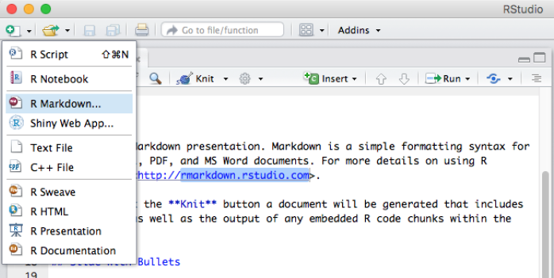
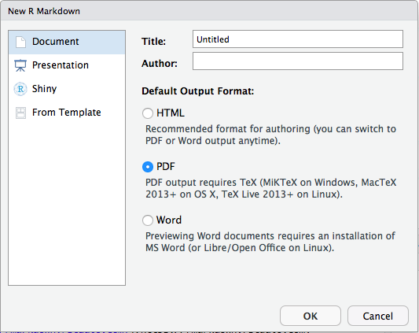
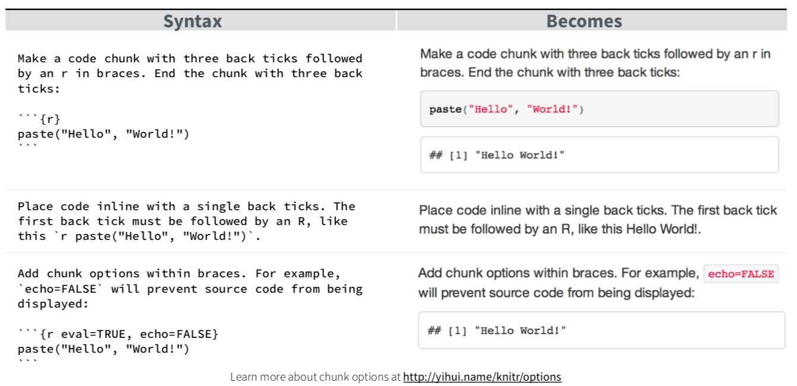

```{r setup, include=FALSE}
knitr::opts_chunk$set(echo = FALSE)   #global option

stdt <- date()
```


# Intro

## Required Materials

Materials for this presentation can be found on [\textcolor{blue}{GitHub}](https://github.com/kburdett5/Dynamic_Reporting_NUpres) : https://github.com/kburdett5/Dynamic_Reporting_NUpres


- R
    + RStudio: https://rstudio.com/products/rstudio/download/
    + R version 3.5.2 or later
    + R packages: knitr, survminer, kableExtra, tableone, plotly, broom, tidyverse, survival (install.packages("knitr"))
- LaTeX
    + https://www.latex-project.org/get/
    


## What is R Markdown

Popular data science tool for efficient and dynamic reporting. It is used to record your reproducible research (save and execute code) in order to create beautiful and easily sharable reports. 


* Flexible
    + Create dynamic output and inline code
* Reproducible Research
    + Code and report combined
* Fun endless possibilities!


## No Copy-Paste Results

Imagine you finish a project and generate the results. 

\vspace{3mm}

THEN... the data changes, or they want to use $\alpha = 0.1$ reaction if results were copy-pasted.


\begin{center}
		\begin{figure}[]
			\centering
			\includegraphics[width=3cm,height=3cm,keepaspectratio]{Rpres_files/homealone_freakout.png}
		\end{figure}
	\end{center}

If using R Markdown, simply render the file and VOILA you have your beautiful report!


## How it works

* Markdown is a formatting syntax
* Dynamic reporting allows you to export finished report in several formats (Word, html, PDF, LaTeX Beamer slides, and more). 


When you run (render), feeds to knitr which executes code chunks. Then pandoc processes it and creates the finished format.

[\textcolor{blue}{https://rmarkdown.rstudio.com/lesson-2.html}](https://rmarkdown.rstudio.com/lesson-2.html)


<!---------------------------------------------------------------->
<!---------------------  Getting Started  ------------------------>
<!---------------------------------------------------------------->
# Getting Started 

## Getting Started

* R package "knitr" (install.packages("knitr"))
    + .Rmd (R + Markdown)
    + .Rnw (R + LaTeX)
    + Allows use of various languages 


    
We will be using R Markdown (.Rmd). If you are more comfortable with LaTeX, you may want to try using R Sweave (.Rnw). 
    


## R Markdown File (File -> New File -> R Markdown)

{width=85%}

[\textcolor{blue}{https://rmarkdown.rstudio.com}](https://rmarkdown.rstudio.com)

[\textcolor{blue}{https://rstudio.com/wp-content/uploads/2015/03/rmarkdown-reference.pdf}](https://rstudio.com/wp-content/uploads/2015/03/rmarkdown-reference.pdf)


## Select Report Format




## YAML Header

\begin{columns}
		\column[]{0.45\linewidth}
		\underline{Basic Header:}
		\centering
		\includegraphics[]{Rpres_files/simple_header.png}
		
		\column[]{0.45\linewidth}
		\underline{Complex Header:}
		\centering
		\includegraphics[]{Rpres_files/complex_header.png}
	\end{columns}

\vspace{3mm}

* Applied to entire document
* Output changes report format

\vspace{2mm}

For more details: [\textcolor{blue}{R Markdown Cheatsheet}](https://rstudio.com/wp-content/uploads/2015/02/rmarkdown-cheatsheet.pdf)


## Embed Code




## Formatting

Some helpful Markdown syntax. You can also utilize LaTeX or HTML code.
\vspace{3mm}

* `**BOLD**`   --->   **BOLD** text
* `*italics*`  --->   *italics* text
* `$\frac{\alpha}{5}$`  ---> $\frac{\alpha}{5}$
* Graphics
    + ` ```{r, fig.width=5, fig.height=4}`
    
\vspace{5mm}
For more details: [\textcolor{blue}{R Markdown Cheatsheet}](https://rstudio.com/wp-content/uploads/2015/02/rmarkdown-cheatsheet.pdf)


## Instructions Inside Chunks

- **echo**: Display code. `echo = FALSE` - hides code and displays results 
- **include**: `include = FALSE` - Run code without displaying anything in document
- **message**: Display messages. `message = FALSE` - suppresses messages from being displayed in document. Same idea for `error = FALSE` and `warning = FALSE` 
- **results**: Set to 'asis' to let text output be written as is. Write raw Markdown text from R code. Ex: `cat('**Markdown** is cool. \n')`
- **tidy**: Tidy code for display

\vspace{3mm}
For more details: [\textcolor{blue}{R Markdown Cheatsheet}](https://rstudio.com/wp-content/uploads/2015/02/rmarkdown-cheatsheet.pdf)

[\textcolor{blue}{https://bookdown.org/yihui/rmarkdown/r-code.html}](https://bookdown.org/yihui/rmarkdown/r-code.html)


<!---------------------------------------------------------------->
<!-------------------  Loop through Slides  ---------------------->
<!---------------------------------------------------------------->
# Loop through Slides

## Loop Slides

* Useful when repetition is needed
* Create Box Plots for continuous variables in iris data
    + `results='asis'`: Write raw Markdown text from R code
    + Slide title: `cat("##Box Plot for", i, "\n") `
    + Text on slides: `cat("Assess the distribution of", i, "\n")`
    + Box Plots:  `boxplot(iris[,i], horizontal = TRUE, xlab = i)`

\begin{center}
		\begin{figure}[]
			\centering
			\includegraphics[width=7cm,height=7cm,keepaspectratio]{Rpres_files/loopSlides.png}
		\end{figure}
\end{center} 


```{r, results='asis', out.width= "70%"}
nameval <- names(iris)[!names(iris) == "Species"]
for(i in nameval){
   cat("\n")
   cat("##Box Plot for", i, "\n") 
   cat("Assess the distribution of", i, "\n")
   boxplot(iris[,i], horizontal = TRUE, xlab = i)
   cat("\n")
}
```


<!---------------------------------------------------------------->
<!------------------------    Hands-on     ----------------------->
<!---------------------------------------------------------------->
# Hands-on 


## Highlights

\begin{columns}
		\column[]{0.5\linewidth}
		\underline{3D Plots:}
		\centering
		\includegraphics[]{Rpres_files/3D_plot.png}
		
		\column[]{0.5\linewidth}
		\underline{CONSORT:}
		\centering
		\includegraphics[]{Rpres_files/CONSORT_initial.png}
\end{columns}


## HTML Example: 3D Plots

"HTML_example.html"

\begin{center}
		\begin{figure}[]
			\centering
			\includegraphics[]{Rpres_files/3D_screenshot.png}
		\end{figure}
\end{center}


## Word Example: "Word_example.docx"

\begin{center}
\textbf{Megan McCabe, MS} \\
\small Department of Preventive Medicine \\
\small Feinberg School of Medicine \\
\small Northwestern University \\
\end{center}

\begin{center}
		\begin{figure}[]
			\centering
			\includegraphics[]{Rpres_files/Word_screenshot.png}
		\end{figure}
\end{center}


## PDF Example: Interactive

"PDF_example.pdf"

\begin{center}
		\begin{figure}[]
			\centering
			\includegraphics[]{Rpres_files/PDF_screenshot.png}
		\end{figure}
\end{center}


## Exercises
1. Make "statistical analysis plan (SAP)" bold on page 2
2. Add section "Secondary Objective" before "Supplementary" section with description underneath similar to primary objective 
3. Add inline code to replace the hardcoded 56 at the end of page 1 ("will result in 56 subjects")
4. Show the code that generates the Kaplan-Meier Plots
5. CONSORT
    + Add bordered box underneath "Population of Interest" titled "Final Box"
    + Add an arrow from "Population of Interest" to the box you just created
    + Extra: Create "Arm A" and "Arm B" boxes below "Final Box" in yellow with arrows

\begin{center}
		\begin{figure}[]
			\centering
			\includegraphics[width=3cm,height=3cm,keepaspectratio]{Rpres_files/CONSORT_extra.png}
		\end{figure}
\end{center} 


<!-----------------------    Exercise 1    ----------------------->
## Exercise 1
1. Make "statistical analysis plan (SAP)" bold on page 2


## Exercise 1: Answer
1. Make "statistical analysis plan (SAP)" bold on page 2

\vspace{8mm}

`**statistical analysis plan (SAP)**` 


<!-----------------------    Exercise 2    ----------------------->
## Exercise 2
2. Add section "Secondary Objective" before "Supplementary" section with description underneath similar to primary objective 


## Exercise 2: Answer
2. Add section "Secondary Objective" before "Supplementary" section with description underneath similar to primary objective 

\vspace{8mm}

`#Secondary Objective` \
\vspace{1mm}
`\underline{Secondary Objective:} Define HERE`


<!-----------------------    Exercise 3    ----------------------->
## Exercise 3
3. Add inline code to replace the hardcoded 56 at the end of page 1 ("will result in 56 subjects") 


## Exercise 3: Answer
3. Add inline code to replace the hardcoded 56 at the end of page 1 ("will result in 56 subjects")

\vspace{8mm}

will result in `'r nrow(analysisdat)'` subjects


<!-----------------------    Exercise 4    ----------------------->
## Exercise 4
4. Show the code that generates the Kaplan-Meier Plots


## Exercise 4: Answer
4. Show the code that generates the Kaplan-Meier Plots

\vspace{8mm}

Remove `echo=FALSE`


<!-----------------------    Exercise 5    ----------------------->
## Exercise 5
5. Edit CONSORT
    + Add bordered box underneath "Population of Interest" titled "Final Box"
    + Add an arrow from "Population of Interest" to the box you just created
    + Extra: Create "Arm A" and "Arm B" boxes below "Final Box" in yellow with arrows

\begin{center}
		\begin{figure}[]
			\centering
			\includegraphics[width=5cm,height=5cm,keepaspectratio]{Rpres_files/CONSORT_extra.png}
		\end{figure}
\end{center} 


## Exercise 5: Answer

* Add bordered box underneath "Population of Interest" titled "Final Box"

\begin{center}
		\begin{figure}[]
			\centering
			\includegraphics[width=6cm,height=6cm,keepaspectratio]{Rpres_files/CONSORT_a.png}
		\end{figure}
\end{center} 

* Add an arrow from "Population of Interest" to the box you just created

\begin{center}
		\begin{figure}[]
			\centering
			\includegraphics[width=6cm,height=6cm,keepaspectratio]{Rpres_files/CONSORT_b.png}
		\end{figure}
\end{center} 


## Exercise 5: Extra Answer

5. Edit CONSORT
    + Extra: Create "Arm A" and "Arm B" boxes below "Final Box" in yellow with arrows

\begin{center}
		\begin{figure}[]
			\centering
			\includegraphics[width=6cm,height=6cm,keepaspectratio]{Rpres_files/extra_CONSORT1_highlighted.png}
		\end{figure}
\end{center} 

\begin{center}
		\begin{figure}[]
			\centering
			\includegraphics[width=6cm,height=6cm,keepaspectratio]{Rpres_files/extra_CONSORT2_highlighted.png}
		\end{figure}
\end{center} 


## Thank You!

\begin{center}
\Huge{Thank You!}
\end{center}


